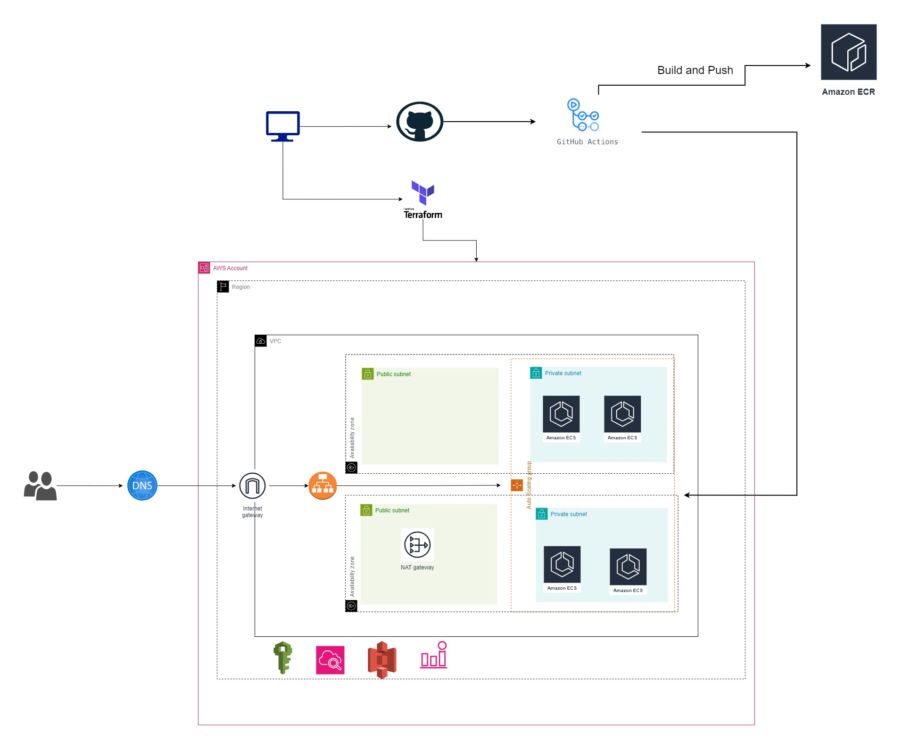

# Terraform-ECS-GitHubAction

<h2>Project Overview</h2>
<p>The project aimed to design and implement a scalable and resilient AWS infrastructure using Terraform for hosting containerized applications deployed with ECS Fargate. The infrastructure included network components, ECS clusters, and CI/CD automation using GitHub Actions.</p>



<h2>Pre-requisites</h2>
<p><b>Credentials:</b> Need AWS Configure
<p><b>S3 Bucket:</b> You need to have a S3 Bucket to store Terraform State Files</p>

<h2>Module Structure</h2>


<h2>Terraform Command</h2>

```terraform
For Terraform Root Module:

terraform init
terraform validate
terraform plan
terraform apply --auto-approve
```
<h2>Network Module</h2>
<p>The Network module was responsible for creating the foundational components of the architecture within the VPC. This included defining the VPC itself, along with the associated subnets, route tables, and Internet Gateway. Two public subnets were designated for the ALB and one for NAT Gateway, while two private subnets were established across different availability zones to host the Auto Scaling Group with Desired 2 EC2 Instances.</p>

```terraform
module "network" {
  source = "./Network"
  vpc_cidr_block   = "10.200.0.0/16"
  vpcname = "wlo-terraform-vpc"
  subnet-name = "terraform-subnet"
  wlo-terraform-igw-name = "wlo-terraform-igw"
  natgw-name = "terraform-nat-gw"
  publicrtname = "public-subnet-routetable"
  privatertname = "private-subnet-routetable"
}
```
